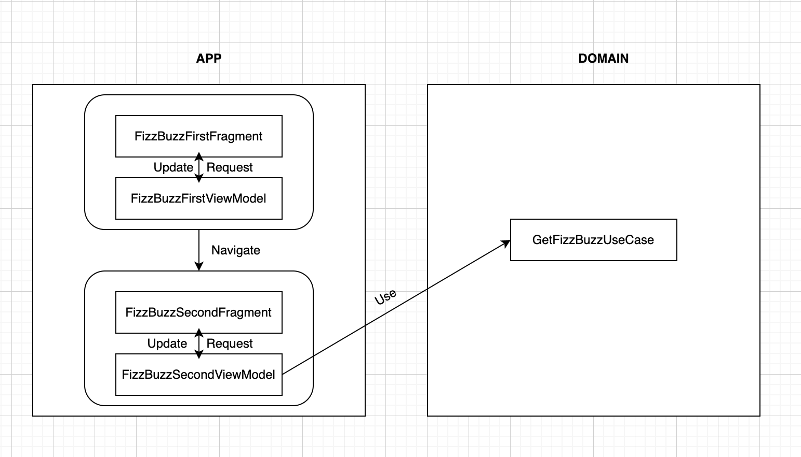

# Fizz Buzz Application

This application is completely written in kotlin using MVVM architecture.

Architecture
-----------

ScreenShot
-----------

  
  

Libraries
-----------
- Androidx
- RxJava2
- Koin
- Google Material Design
